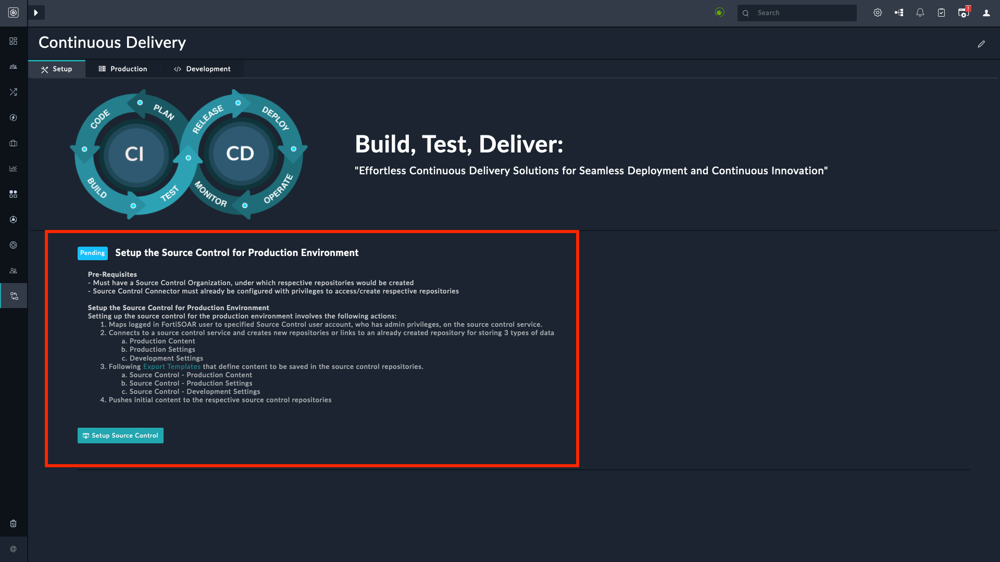

# Release Information

- **Version**: 1.0.1

- **Certified**: Yes

- **Publisher**: Fortinet  

- **Compatibility**: 7.4.3 and later

- **Applicable**: View Panel and Listing View

- [Release Notes](./widget/release_notes.md)

# Overview

The **Record CTA Tile** widget helps visualize records based on a specified data source by clicking the CTA (Call to Action) button. An example of using the record widget would be displaying a list of tasks in the Record CTA Tile view on the **Setup** tab of the **Continuous Delivery** page.

The following image highlights the configured Record CTA tile:

## Next Steps

| [Installation](./docs/setup.md#installation) | [Configuration](./docs/setup.md#configuration) | [Usage](./docs/usage.md) |
|----------------------------------------------|------------------------------------------------|--------------------------|