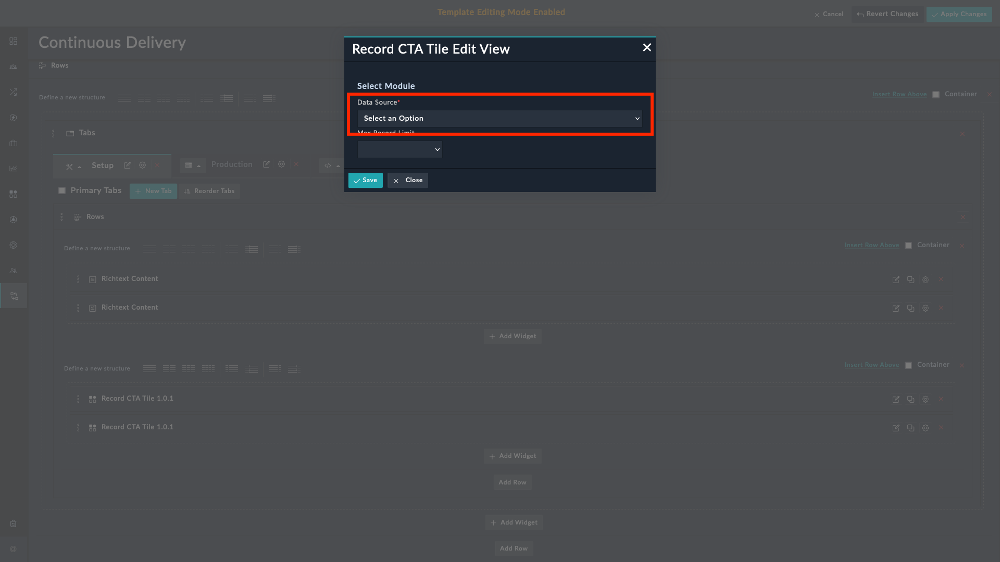
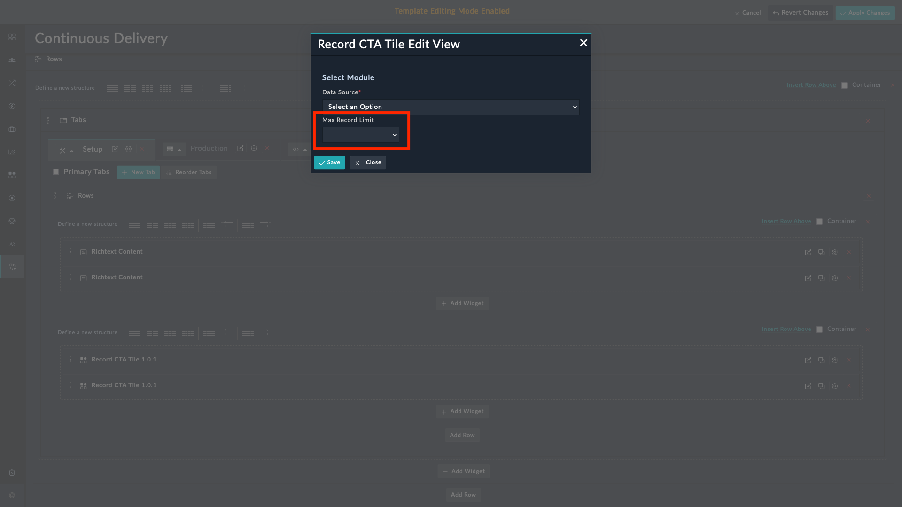
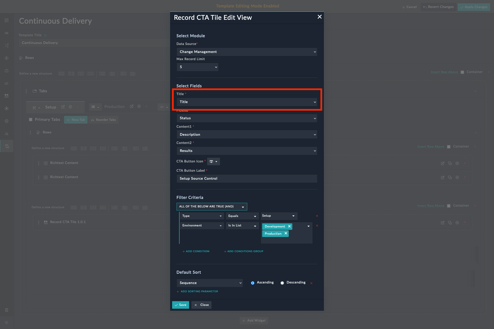
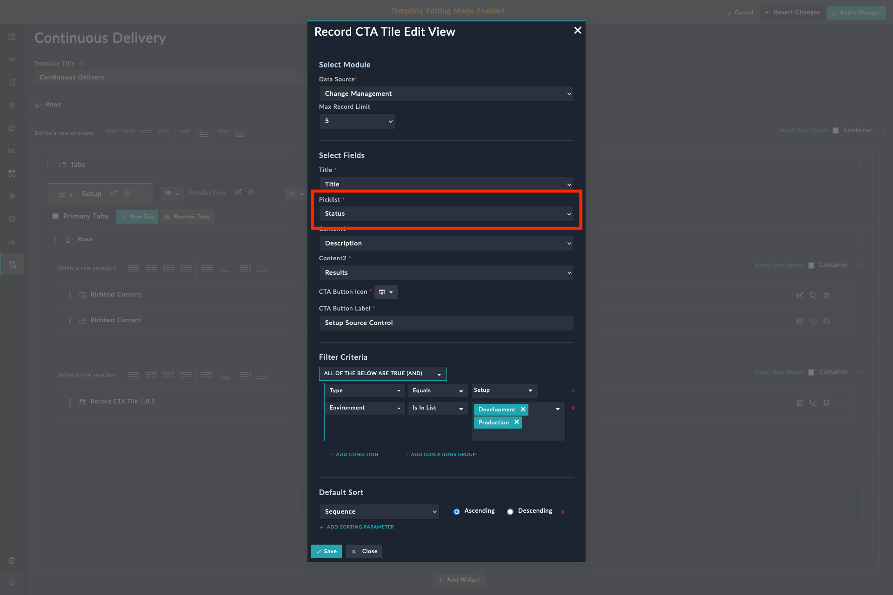
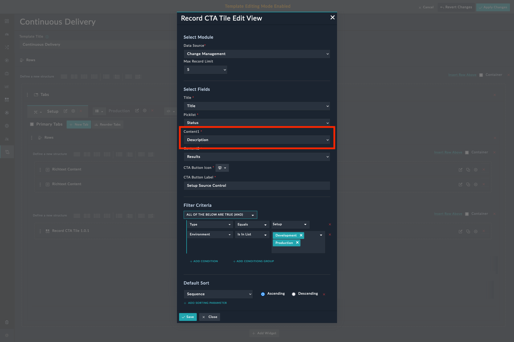
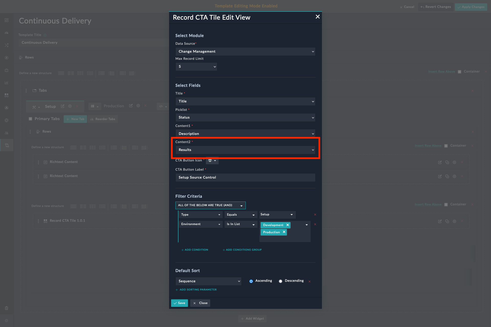
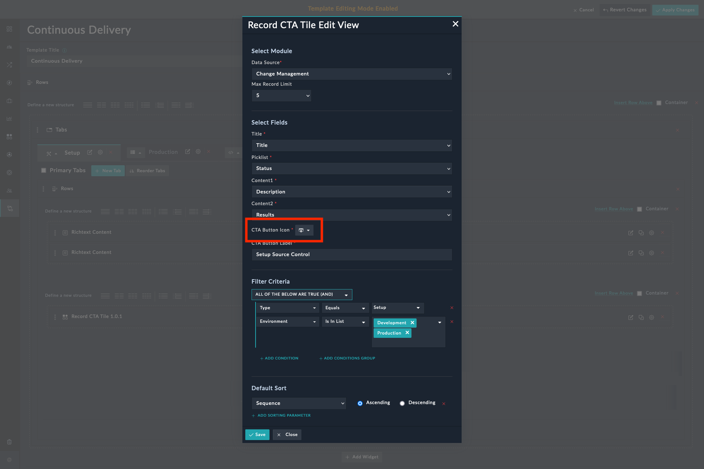
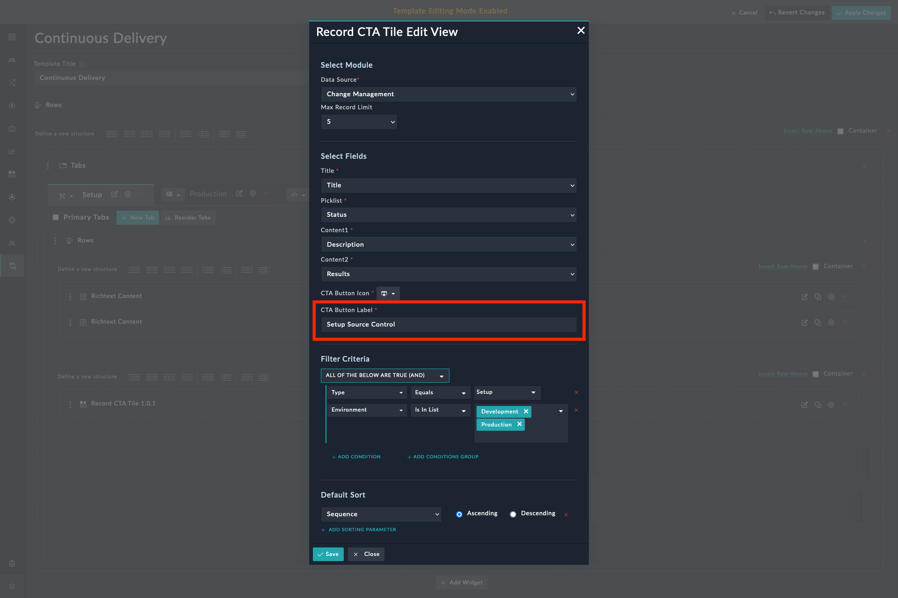
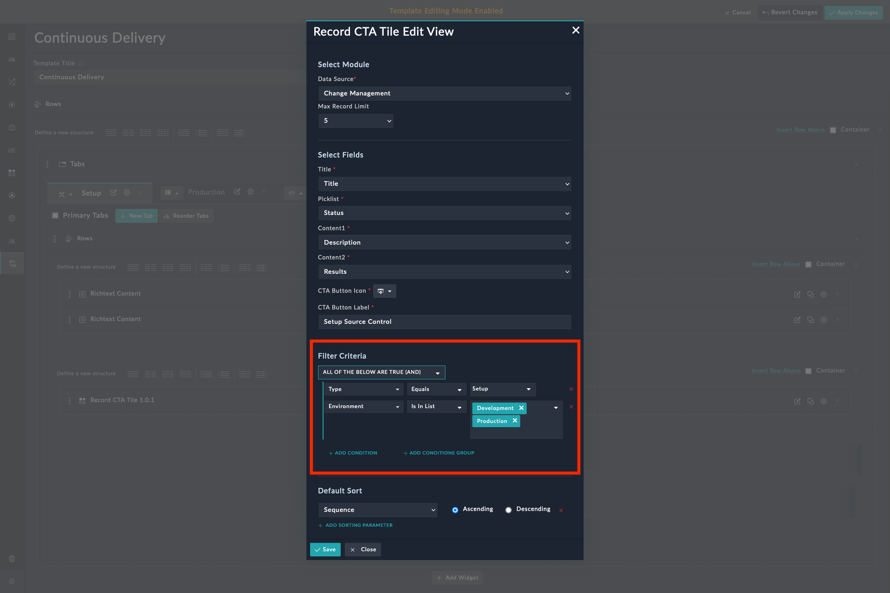
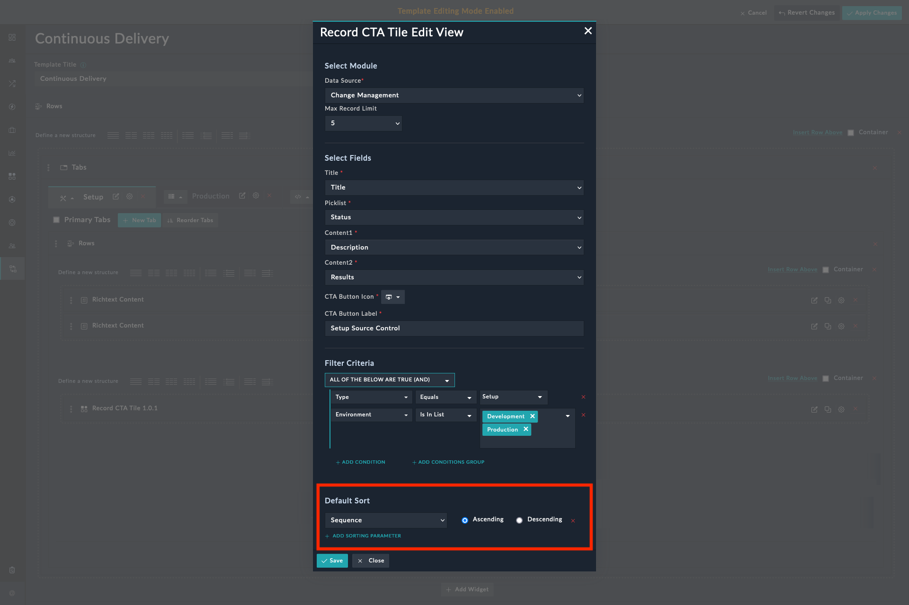

| [Home](../README.md) |
|----------------------|

# Usage

The **Record CTA Tile** widget helps visualize records based on a specified data source by clicking the CTA (Call to Action) button. An example of using the record widget would be displaying a list of tasks in the Record CTA Tile view on the **Setup** tab of the **Continuous Delivery** page.

## Features

- Visualize records based on the specified data source.
- Configure the widget by choosing an *icon*, *title*, *subtitle*, and by specifying filters and default sort order.

  >**Note**: A maximum of 20 records are fetched for rendering details.

## Configuring Record CTA Tile Widget

As an example, in the following section we have used the widget with the **Change Management** module.

1. Edit a module's view template and select the **Add Widget** button.

2. Select **Record CTA Tile** from the list of installed widgets.

3. Select the module to use as data source in the **Data Source** field.

    

4. Select the maximum records to display in the **Max Record Limit** field.

    

5. Specify a title of the widget in the **Title** field.

    

6. Select the field containing the values to set as the drop-down options in the **Picklist** field. For example, if you select **Status**, the card displays the statuses of the **Continuous Delivery** record.

    

7. Select the field containing the description of the CTA Tile from the **Content 1** field. For example, if you select **Description**, the card displays the description of the **Continuous Delivery** record.

    

8. Select the field containing the description of the CTA Tile from the **Content 2** field. For example, if you select **Results**, the card displays the results of the **Continuous Delivery** record.

    

9. Select an icon to use with the CTA Tile in the **CTA Button Icon** field.

    

10. Specify the text for the label to display on the CTA Button in the **CTA Button Label** field.

    

11. Specify the filter criteria to display only the relevant CTA Tiles using the **Filter Criteria** field. For example, To display only those records whose `Type` is `Production`, add a filter criterion such as `Type Equals Production`.

    

12. Specify the sort order to display the filtered CTA Tiles **Default Sort** field.

    

## Next Steps

| [Installation](./setup.md#installation) | [Configuration](./setup.md#configuration) |
|-----------------------------------------|-------------------------------------------|
