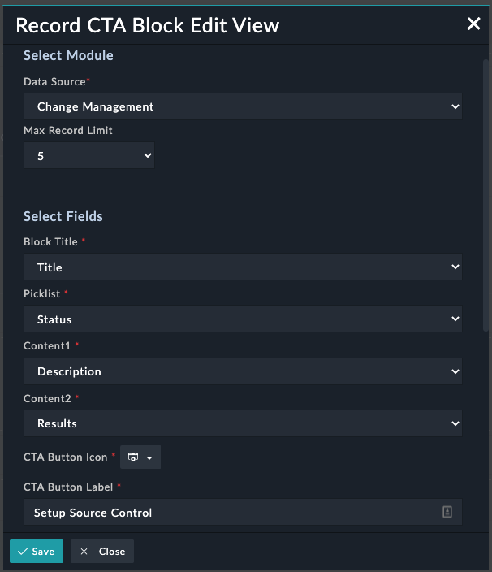
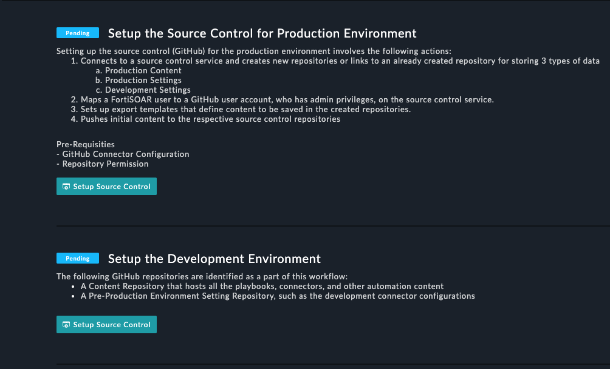

| [Home](../README.md) |
|--------------------------------------------|

# Usage

The **Record CTA Tile** widget helps visualize records based on a specified data source by clicking the CTA (Call to Action) button. An example of using the record widget would be displaying a list of tasks in the Record CTA Tile view on the **Setup** tab of the **Continuous Delivery** page.

Following pointers showcase how this widget seamlessly integrates with a solution pack such as **Continuous Delivery**:

- **Group records using a filter criterion**: To display only those records whose `Type` is `Production`, add a filter criterion such as `Type Equals Production`.
- Add this view on a list view or detail view of a module's record. 

## Features
- Helps users visualize records based on the specified data source.
- Allows users to configure the widget by choosing the CTA button *icon*, *label*, *title*, *picklist*, *content1*, *content2*, and by specifying filters and default sort order.

  >**Note**: A maximum of 20 records are fetched for rendering details.

## Record CTA Block Widget Views

### Record CTA Block Widget - Edit View

### Record CTA Block Widget - List View

